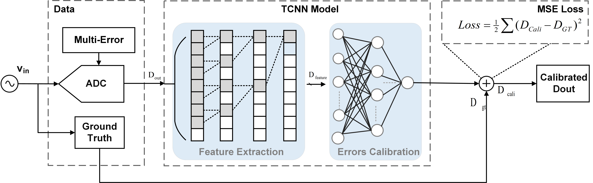

# Enhanced High-Speed ADC Calibration: 
We release the code of Enhanced High-Speed ADC Calibration: A JointApproach for Dynamic and Static Errors via Temporal Error Learning in our papers:
## Introduction
We propose an integrated calibration neural network. The network is meticulously structured into two key components:error extraction and error fitting. Within the error extraction component, we employ temporal convolutional network (TCN) to extract the local and long-term features, from the ADC output sequences. The error fitting component, comprising a three-layer FCNN, is designed to finally fit the error in the ADC output.


## Requirements
* Python 3.11.8
* Pytorch 2.2.1
* CUDA 12.1
  ```
  pip install -r requirements.txt
  ```
  

## Acknowledgement
We really appreciate the contributors of following codebases.

[TCN] (http://github.com/locuslab/TCN)
