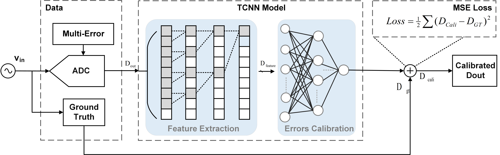

# High-Speed ADC Signal Restoration via Temporal Distortion Learning: 
We release the code of Enhanced High-Speed ADC Signal Restoration: A JointApproach for Dynamic and Static distortions via Temporal distortion Learning in our papers:
## Introduction
We propose an integrated neural network. The network is meticulously structured into two key components:distortion extraction and distortion fitting. Within the distortion extraction component, we employ temporal convolutional network (TCN) to extract the local and long-term features, from the ADC output signals. The distortion fitting component, comprising a three-layer FCNN, is designed to finally fit the distortion in the ADC output.


## Requirements
* Python 3.11.8
* Pytorch 2.2.1
* CUDA 12.1
  ```
  pip install -r requirements.txt
  ```
## Datasets
We will provide the ADC datasets and analysis methods later.
## Usage
The network framework is contained in folder, with the following structure:
```
models.py
utils.py
train.py
test.py
```
To run this network, you need to train the network model by running ```train.py``` then run ```test.py```to obtain the network output results for subsequent analysis.
## Acknowledgement
We really appreciate the contributors of following codebases.

[TCN] (http://github.com/locuslab/TCN)
